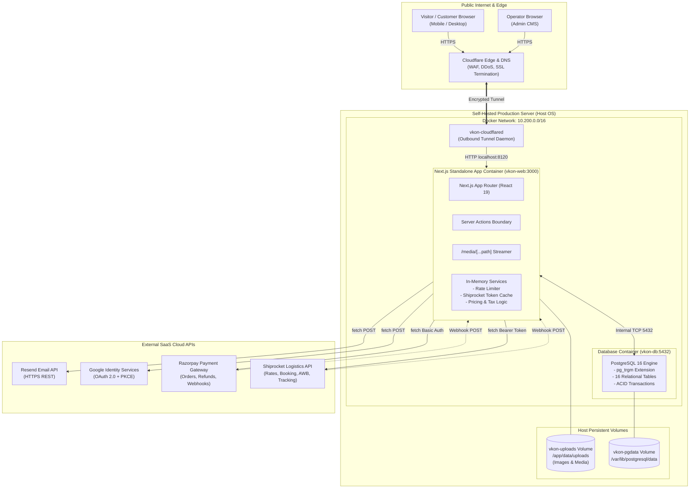
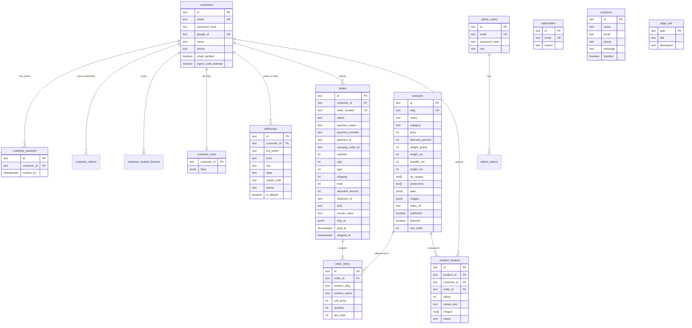
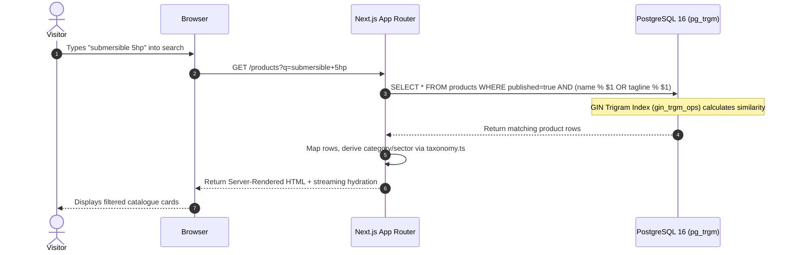
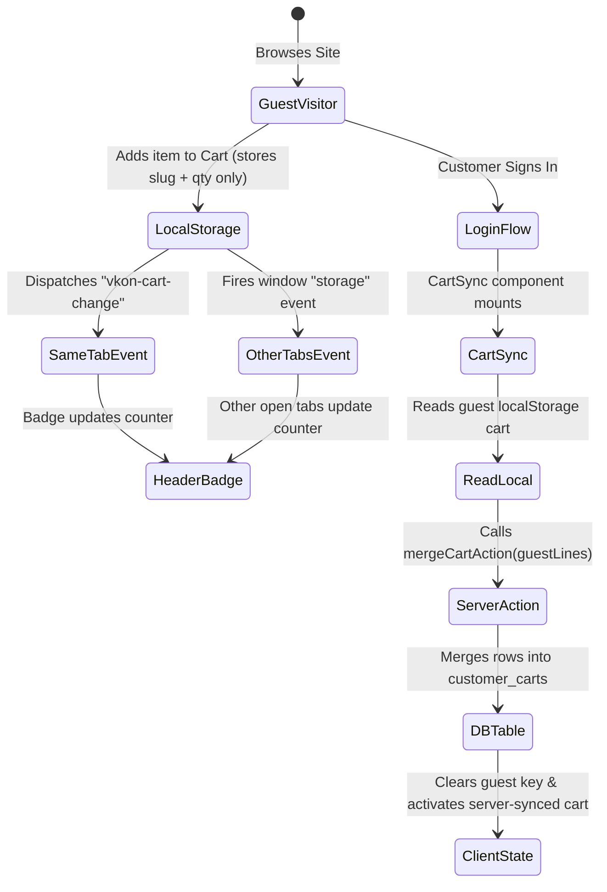
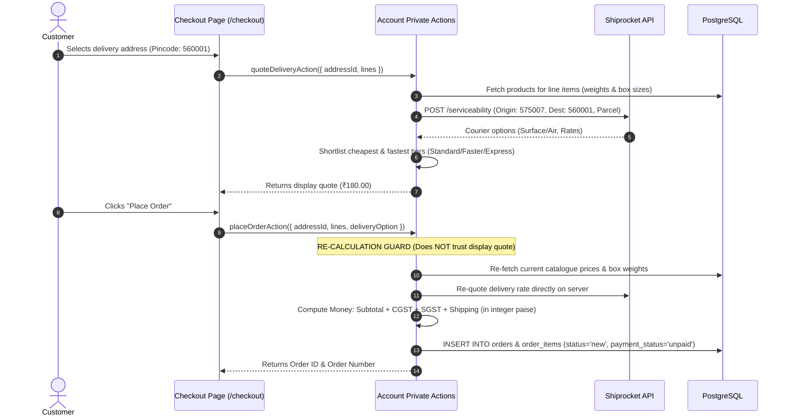
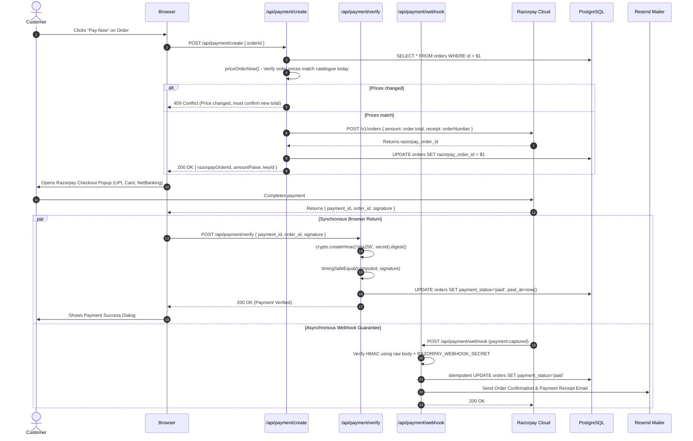
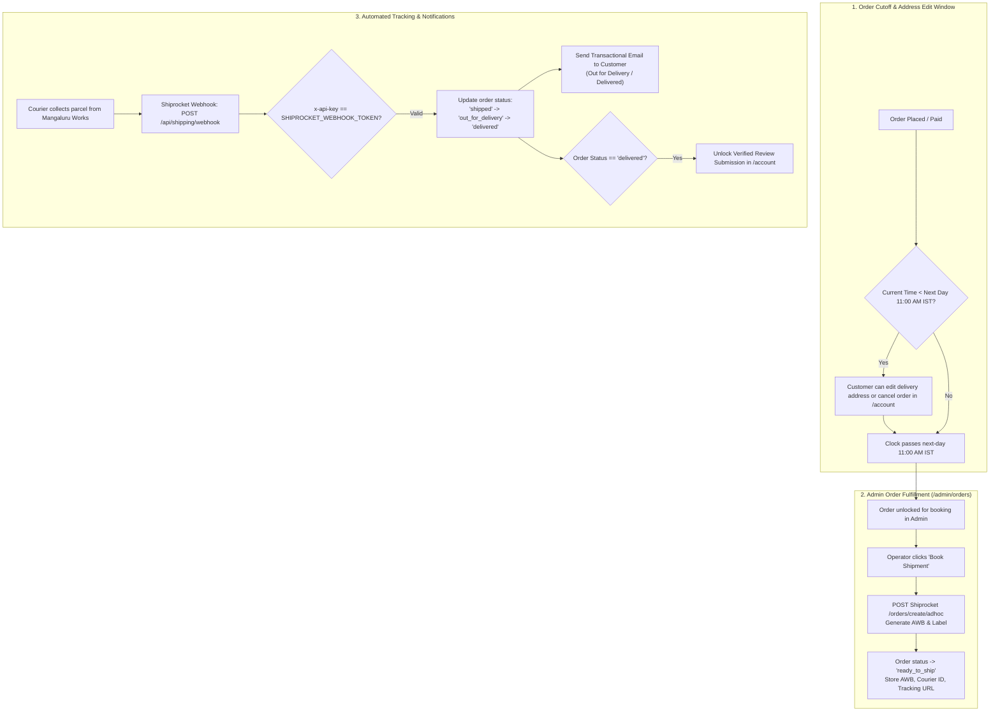
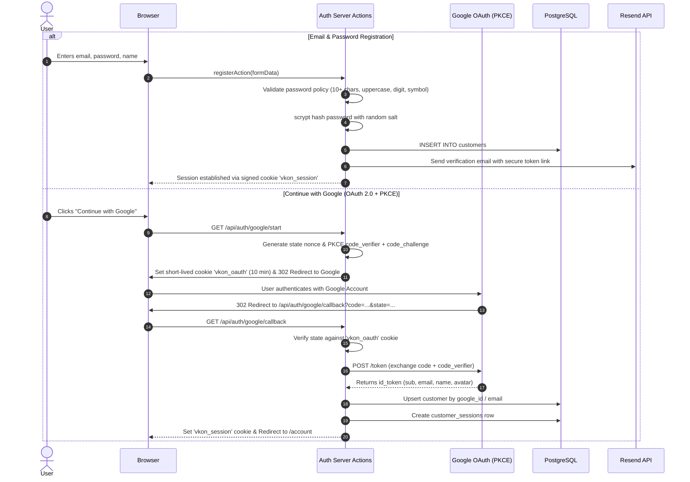

# System Design & Architecture — vkon.in

> **Document Version:** 1.0.0  
> **Last Updated:** September 2026  
> **Target Audience:** Engineers, Architects, and Technical Maintainers  
> **Scope:** Full-stack system architecture, tools inventory, data flow diagrams, business logic, constraints, and operational guides.

---

## Table of Contents

1. [Executive Summary & Purpose](#1-executive-summary--purpose)
2. [Complete Tools & Technology Inventory](#2-complete-tools--technology-inventory)
3. [System Architecture & High-Level Design](#3-system-architecture--high-level-design)
4. [Database & Data Models](#4-database--data-models)
5. [End-to-End Data Flows & Visual Diagrams](#5-end-to-end-data-flows--visual-diagrams)
   - [5.1 Catalogue Browsing & Trigram Search](#51-catalogue-browsing--trigram-search)
   - [5.2 Cart Lifecycle & Multi-Tab Synchronization](#52-cart-lifecycle--multi-tab-synchronization)
   - [5.3 Checkout & Dual Delivery Quoting](#53-checkout--dual-delivery-quoting)
   - [5.4 Payment Flow (Razorpay)](#54-payment-flow-razorpay)
   - [5.5 Fulfillment & Tracking (Shiprocket)](#55-fulfillment--tracking-shiprocket)
   - [5.6 Customer Authentication & Security (Email/Password & Google OAuth PKCE)](#56-customer-authentication--security)
   - [5.7 Admin Authentication & Role Security Boundary](#57-admin-authentication--role-security-boundary)
   - [5.8 Reviews Moderation & Contact/Enquiry Inboxes](#58-reviews-moderation--contactenquiry-inboxes)
6. [Core Business Logic & Mathematical Models](#6-core-business-logic--mathematical-models)
7. [Load-Bearing Constraints & Traps That Cost Real Time](#7-load-bearing-constraints--traps-that-cost-real-time)
8. [Design System, Contrast & Typography](#8-design-system-contrast--typography)
9. [Outstanding Technical Debt & Production Checklist](#9-outstanding-technical-debt--production-checklist)

---

## 1. Executive Summary & Purpose

**vkon.in** is a production web application built for **Vkon Automation**, an Indian manufacturer of electronic motor starters, digital control panels, and automation controllers for agricultural pumps, commercial installations, and industrial machinery.

### Target Persona & Constraints
- **Primary Audience:** Indian farmers, rural agricultural pump dealers, and industrial electrical contractors.
- **Client Device Profile:** Mid-range to entry-level Android devices operating over spotty 2G/3G/4G cellular connections in rural India.
- **Core User Goal:** Rapidly answer three practical questions:
  1. *Does this starter/panel match my pump’s Horsepower (HP) rating?*
  2. *What electrical protections does it provide (dry run, single phasing, voltage spikes)?*
  3. *How do I order it, pay for it, or reach technical support right now?*
- **Key Design Philosophy:** Minimal JavaScript payload, zero external bloat, deterministic server-side rendering, instant page transitions, extreme battery/data efficiency, and graceful offline/degraded fallbacks.

---

## 2. Complete Tools & Technology Inventory

```
+---------------------------------------------------------------------------------+
|                                 VKON.IN STACK                                   |
+------------------------------------+--------------------------------------------+
| Category                           | Technology / Tool                          |
+------------------------------------+--------------------------------------------+
| Core Framework                     | Next.js 16.2.12 (App Router, Server Act.)  |
| UI Library                         | React 19.2.4 (Server & Client Components)  |
| Language                           | TypeScript 5 (Strict Mode)                 |
| Styling Engine                     | Tailwind CSS v4 (@tailwindcss/postcss)     |
| Database                           | PostgreSQL 16 (Alpine Container)           |
| DB Client Driver                   | pg 8.22.0 (node-postgres connection pool)  |
| DB Text Search Extension           | pg_trgm (Postgres Trigram GIN indexes)     |
| Cryptography & Auth                | Node.js native crypto (scrypt, HMAC, PKCE) |
| Transactional Email                | Resend API (plain HTTPS REST via fetch)    |
| Social Sign-in                     | Google OAuth 2.0 + PKCE (native fetch)     |
| Payment Gateway                    | Razorpay API (Basic Auth fetch + Webhook)  |
| Logistics & Fulfillment            | Shiprocket API (Bearer Token fetch)        |
| Ingress & Edge Security            | Cloudflare Tunnel (cloudflared container)  |
| Containerization & Runtime         | Docker 26+ & Docker Compose (Alpine Node)  |
| Typography                         | Self-hosted WOFF2 (Inter + IBM Plex Mono)  |
| Linter & Quality                   | ESLint 9 + eslint-config-next 16.2.12      |
+------------------------------------+--------------------------------------------+
```

### The Zero-SDK Runtime Dependency Rule
The `package.json` contains strictly **four** runtime dependencies:
```json
"dependencies": {
  "next": "16.2.12",
  "pg": "^8.22.0",
  "react": "19.2.4",
  "react-dom": "19.2.4"
}
```
**Why zero external SDKs?**
- No `nodemailer` (SMTP is a socket protocol; Resend uses plain HTTPS REST).
- No `@razorpay/razorpay` (SDK wraps 2 REST endpoints; native `fetch` keeps runtime bundle clean).
- No `shiprocket-node` (SDK wraps 4 REST calls; handled via native `fetch`).
- No `next-auth` / `auth.js` (standard OAuth 2.0 PKCE implemented cleanly in ~150 lines in `src/lib/google.ts`).
- No UI component libraries, no animation libraries, no heavy ORMs (Prisma/Drizzle).

### Operational & Utility Scripts
- `scripts/start-standalone.mjs`: Standalone production server runner (copies static assets & sets upload volume).
- `scripts/db-setup.mjs`: Local Postgres schema initializer.
- `scripts/db-seed.mjs` / `scripts/seed-demo.sql`: Demo catalogue generator (8 demo agricultural products).
- `scripts/db-export.mjs` & `scripts/db-restore.mjs`: Database backup and restoration tools.
- `scripts/setup-local.mjs`: Interactive local developer environment bootstrapper.
- `scripts/shiprocket-check.mjs`: Live courier rate & serviceability CLI diagnostics tool.
- `scripts/update-prices.mjs`: Bulk catalogue price and discount adjustment utility.
- `scripts/make-placeholder-images.py`: SVG/PNG technical placeholder asset generator.

---

## 3. System Architecture & High-Level Design

The entire platform runs as a self-hosted, multi-container Docker Compose application behind an encrypted Cloudflare Tunnel.



### Layering & Separation of Concerns
The repository adheres to a strict one-directional dependency hierarchy:

```
src/app/(site)/          Public customer routes & public forms
src/app/admin/           Admin CMS routes & restricted server actions
      │
      ▼
src/components/          Presentation & interactive widgets (NO direct DB access)
      │
      ▼
src/lib/                 Business logic, database queries, crypto, external API fetchers
      │
      ▼
src/content/             Static tax, taxonomy, site metadata, navigation constants
```

### Rendering Model: Dynamic vs. Static
- **`force-dynamic` Routes:** Everything displaying dynamic content renders on demand per request:
  - `/` (Home), `/products`, `/products/[slug]`, `/sitemap.xml`
  - `/cart`, `/checkout`, `/account/**`, and all `/admin/**`
- **Why no ISR (`revalidatePath`)?** In Next.js, ISR marks stale cache but still serves the old HTML to the immediate next request. When an admin creates or edits a product or order, they expect immediate reflection. A single indexed query over connection-pooled Postgres executes in under 2ms—negligible compared to cellular network RTT.
- **Fail-Safe Reads (`safeQuery`):** All public read operations wrap database queries in fallback handlers that return empty arrays `[]` rather than crashing into 500 pages if the database experiences a momentary restart. Admin actions deliberately throw loud errors so operators are instantly notified.

---

## 4. Database & Data Models

PostgreSQL schema definitions live in `src/lib/db/schema.sql`. All statements are strictly idempotent (`CREATE ... IF NOT EXISTS`, `ALTER ... ADD COLUMN IF NOT EXISTS`).

### Entity Relationship Diagram



### Table Dictionary
1. **`products`**: Catalogue inventory, technical spec key-values (`JSONB`), protection tags array, image array, video link, list price, discount, packed weight and dimensions, and SEO overrides.
2. **`customers`**: End-user accounts supporting password authentication (`scrypt`) and Google OAuth account linking.
3. **`customer_sessions`**: Server-side revocable session storage (30-day lifetime).
4. **`customer_tokens`**: Time-limited cryptographic tokens for email verification and password reset.
5. **`customer_trusted_devices`**: Device fingerprint records to bypass 2FA challenges on recognized hardware.
6. **`customer_carts`**: Server-side cart persistence across devices for signed-in users.
7. **`addresses`**: Stored customer shipping and billing addresses.
8. **`orders`**: Immutable purchase records, financial breakdown (subtotal, CGST, SGST, shipping, total in paise), payment status, and shipping state.
9. **`order_items`**: Frozen snapshot of purchased products, quantities, and price at moment of purchase.
10. **`admin_users`**: CMS operators with RBAC roles (`super`, `admin`, `staff`).
11. **`admin_tokens`**: Admin password reset tokens.
12. **`site_settings`**: Dynamic system configuration key-values.
13. **`product_reviews`**: Verified customer ratings (1–5 stars), written reviews, uploaded photos/videos, and moderation states (`pending`, `approved`, `rejected`).
14. **`enquiries`**: Contact form submissions from `/contact`.
15. **`subscribers`**: Newsletter email list entries collected from the site footer.
16. **`page_seo`**: Per-route static page SEO title and description overrides editable via `/admin/seo`.

---

## 5. End-to-End Data Flows & Visual Diagrams

### 5.1 Catalogue Browsing & Trigram Search



---

### 5.2 Cart Lifecycle & Multi-Tab Synchronization

The cart is designed to maintain zero server load for guest users, while seamlessly syncing to the database upon customer authentication.



---

### 5.3 Checkout & Dual Delivery Quoting

> **Critical Rule:** The delivery rate is quoted twice, and only the second calculation counts. The client sends slugs and quantities—never money or shipping fees.



---

### 5.4 Payment Flow (Razorpay)



---

### 5.5 Fulfillment & Tracking (Shiprocket)



---

### 5.6 Customer Authentication & Security



---

### 5.7 Admin Authentication & Role Security Boundary

```mermaid
flowchart TD
    subgraph AdminLogin ["Admin Authentication Flow"]
        AdminUser["Admin Operator"] --> LoginForm["Enters Email + Password at /admin"]
        LoginForm --> AuthModule["src/lib/auth.ts login()"]
        AuthModule --> DBCheck["Lookup in admin_users table"]
        DBCheck --> ScryptVerify["Verify scrypt password hash\n(using timingSafeEqual)"]
        ScryptVerify -- Success --> IssueCookie["Build Signed Token:\nadminId.expires.nonce.HMAC(secret)\nSet httpOnly, secure cookie: 'vkon_admin'"]
        ScryptVerify -- Invalid --> SleepDummy["Execute dummy scrypt\nto prevent timing attack enumeration"]
    end

    subgraph SecurityBoundary ["Mutating Admin Server Action Boundary"]
        ClientRequest["Admin Action Triggered\n(e.g., saveProductAction, refundOrderAction)"]
        ClientRequest --> ActionEntry["Action Entrypoint"]
        ActionEntry --> LineOne{"Line 1:\nawait requireAdmin()"}
        LineOne -- No Cookie / Bad Signature / Expired --> ActionRedirect["Throw Redirect to /admin\n(Execution Halts Immediately)"]
        LineOne -- Valid --> RoleCheck{"Check required role\n(super / admin / staff)"}
        RoleCheck -- Unauthorized --> Deny["Return Access Denied"]
        RoleCheck -- Authorized --> ExecuteMutation["Execute Database Mutation & Revalidate"]
    end
```



---

### 5.8 Reviews Moderation & Contact/Enquiry Inboxes

- **Product Reviews Flow:**
  1. A customer can only review a product if they purchased it in an order marked `delivered`.
  2. Submitted reviews are stored in `product_reviews` with status `pending`.
  3. Operator inspects review text, star ratings, and photo/video attachments in `/admin/reviews`.
  4. Moderation actions: `approve` (becomes publicly visible on product page), `reject` (hidden), or `pending`.
- **Enquiry & Contact Inbox Flow:**
  1. Visitor submits contact form on `/contact` (protected by hidden honeypot and in-memory rate limiter).
  2. Enquiry is saved in `enquiries` table (`handled = false`).
  3. Immediate email alert is dispatched to `support@vkon.in`.
  4. Operator reviews and marks enquiry handled in `/admin/enquiries`.

---

## 6. Core Business Logic & Mathematical Models

### 6.1 Money & Integer Paise Arithmetic
- To completely eliminate floating-point inaccuracies (`0.1 + 0.2 = 0.30000000000000004`), **every monetary value in the database, server actions, and Razorpay calls is stored in integer paise** (1 Rupee = 100 Paise).
- A product's list price (`products.price`) is stored in rupees (M.R.P.), and the discount (`discount_percent`) is stored as an integer (0–99).
- **Selling Price Derivation:**
  $$\text{Selling Price (Rupees)} = \text{round}\left(\frac{\text{price} \times (100 - \text{discountPercent})}{100}\right)$$
  $$\text{Selling Price (Paise)} = \text{Selling Price (Rupees)} \times 100$$
- **GST Tax Structure (Intra-State Sale):**
  $$\text{Subtotal} = \sum (\text{unitPricePaise} \times \text{quantity})$$
  $$\text{CGST (9\%)} = \text{round}(\text{Subtotal} \times 0.09)$$
  $$\text{SGST (9\%)} = \text{round}(\text{Subtotal} \times 0.09)$$
  $$\text{Total Paise} = \text{Subtotal} + \text{CGST} + \text{SGST} + \text{ShippingPaise}$$

### 6.2 Parcel Physics: Volumetric Weight vs. Actual Weight
Couriers calculate billable weight based on whichever is higher: actual scale weight or volumetric weight.
$$\text{Volumetric Weight (kg)} = \frac{\text{Length (cm)} \times \text{Breadth (cm)} \times \text{Height (cm)}}{5000}$$
**The Golden Shipping Rule:** Box size influences shipping rates drastically more than weight. Quoting without box dimensions results in couriers charging 3× to 10× more at pickup than what was collected from the customer. Where dimensions are missing, category defaults from `src/lib/parcel.ts` are automatically enforced.

### 6.3 The 11:00 AM IST Next-Day Cutoff Rule
- When an order is placed, Indian farmers frequently realize they need the panel delivered to their agricultural farm rather than their home village.
- The system enforces a strict window: **The customer may modify the delivery address or cancel the order until 11:00 AM IST on the calendar day after order placement.**
- Conversely, the admin cannot book a courier pickup before this cutoff (unless explicitly acknowledged), preventing mislabeled parcels from leaving the warehouse.

---

## 7. Load-Bearing Constraints & Traps That Cost Real Time

Each constraint below was born from a real incident:

1. **The Server Subnet Collision Trap:**
   - *Incident:* The production server sits on a campus/college network whose captive portal is `172.21.0.1`. Docker's default bridge allocated `172.21.0.0/16`, swallowing network routing to the portal and causing the site to go dark (530 errors).
   - *Fix:* `/etc/docker/daemon.json` explicitly mandates `10.200.0.0/16` for Compose networks and `10.201.0.1/24` for `docker0`. **Never reintroduce Docker default 172.x subnets.**
2. **The `next start` vs Standalone Trap:**
   - Next.js is configured with `output: "standalone"`. Running `next start` throws a warning and breaks in Docker because `.next/static` and `public/` are not bundled in `server.js`.
   - Production must run via `node scripts/start-standalone.mjs` or the Docker CMD `node server.js` with copied assets.
3. **The `docker-compose.yml` Allowlist Trap:**
   - Adding an environment variable to `.env` does nothing on the server unless it is explicitly mapped in `docker-compose.yml` under `services.app.environment`. Missing entries degrade silently without throwing errors.
4. **The `Secure` Cookie HTTP Trap:**
   - The session cookie is marked `Secure`. When testing over a local LAN IP (e.g. `http://192.168.1.50:3000`), modern browsers silently drop the cookie upon HTTP redirect. Always test via `http://localhost:3000` or HTTPS.
5. **The `next/image` URL-based Cache Trap:**
   - Next.js caches optimized images by URL, not file hash. Overwriting an asset in-place without altering its URL will serve stale pixels. Run `rm -rf .next/cache/images` upon manual asset replacements.
6. **The Cloudflare Orange-Cloud Resend Verification Trap:**
   - Leaving Cloudflare proxying (orange cloud) enabled on DNS records required by Resend causes DKIM/SPF domain verification to fail indefinitely without diagnostic errors. Resend DNS records must remain DNS-Only (grey cloud).
7. **Line 1 `requireAdmin()` Invariant:**
   - Next.js Server Actions are public HTTP POST endpoints. Never rely on React page layouts or middleware for security. `await requireAdmin()` must be the very first line of code executed in any mutating admin action.

---

## 8. Design System, Contrast & Typography

The design is influenced by industrial leaders (WAGO, Phoenix Contact, NVIDIA): crisp, functional, ruled, and high-density.

```
Design Token Ground Rules:
1. Corner Radii: Near-square (rounded-[2px]). Avoid bubbly, pill-shaped UI components.
2. Structure First: 1px hairline graphite borders over heavy shadows.
3. Accent Restraint: Primary actions use high-contrast ink/surface. Green accent (#23703D / #4CAE81) is reserved for active states, verified badges, and technical links.
4. Dark Mode Band Inversion: In light mode, dark bands anchor the page. In dark mode, bands elevate with lighter graphite (#2A313A) and hairline borders.
```

### Contrast Matrix (Calibrated for Direct Sunlight on Mobile Screens)
All text elements exceed WCAG AA contrast standards:

| Token Pair | Light Ground (`#F7FAF8`) | Dark Ground (`#0E1113`) | Minimum Standard |
|---|---|---|---|
| **Ink** (Headings, primary text) | 17.1:1 (`#14171A`) | 16.9:1 (`#F2F4F5`) | WCAG AAA (7.0:1) |
| **Body** (Product descriptions) | 8.2:1 (`#454D55`) | 11.3:1 (`#C3C9CF`) | WCAG AA (4.5:1) |
| **Muted** (Technical captions) | 5.8:1 (`#5A636C`) | 7.4:1 (`#9BA3AB`) | WCAG AA (4.5:1) |
| **Accent** (Links, status green) | 6.4:1 (`#23703D`) | 6.9:1 (`#4CAE81`) | WCAG AA (4.5:1) |
| **Band Ink** (Hero & Strip text) | 17.0:1 on `#181D22` | 11.9:1 on `#2A313A` | WCAG AAA (7.0:1) |

---

## 9. Outstanding Technical Debt & Production Checklist

1. **Automated Offsite Database Backups:**
   - Currently, Postgres data resides solely on the `vkon-pgdata` volume. A nightly cron running `pg_dump` pushed offsite (e.g., S3, B2, or encrypted remote server) is a priority to prevent catastrophic data loss.
2. **Inter-State Tax Accounting (IGST vs. CGST/SGST):**
   - The pricing engine currently models 9% CGST + 9% SGST (intra-state Karnataka sales). Inter-state sales across state borders require a unified 18% IGST line based on the customer’s destination PIN code.
3. **Pending Secrets Activation:**
   - Resend, Google OAuth, Razorpay, and Shiprocket are fully coded and tested. Live production enablement requires entering live credentials in the server `.env` and executing `docker compose up -d app`.
4. **Purging Demo Products:**
   - The database currently holds 8 demonstration catalogue items starting with `DEMO`. These must be removed from `/admin/products` once real manufacturing line photography and specs are confirmed.

---
*Maintained under the Vkon Automation engineering guidelines. Keep documentation updated alongside architectural changes.*
